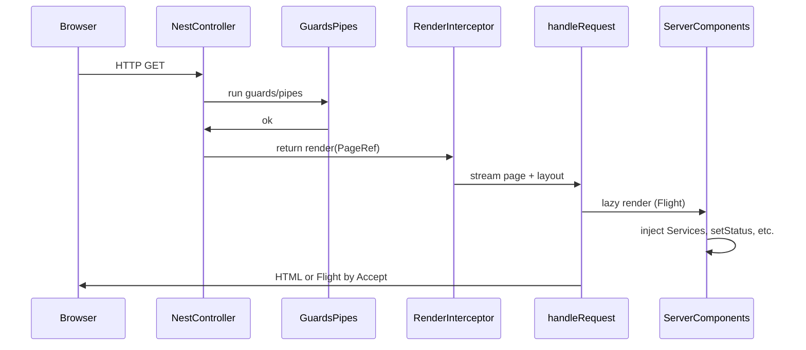

# Overview

This page maps how **nest-can-react** fits into a Nest application. Deep dives live in the [concept guides](concepts/README.md); exact signatures live in [Package APIs](api.md).

---

## Request lifecycle

1. **Nest** matches the route and runs guards and pipes on the controller method.
2. The method returns **`render(PageRef)`** — it does not fetch view data or pass props into React.
3. An interceptor streams the chosen page through the **layout** via `handleRequest` ([`src/flight/handle-request.ts`](../src/flight/handle-request.ts)).
4. **RSC render is lazy** — side effects such as `redirect()` run once the Flight stream starts; the framework reads the first chunk before committing the body so redirects stay clean 3xx responses.
5. **Content negotiation** — `Accept: text/html` → SSR HTML with embedded Flight payload; `Accept: text/x-component` → Flight only (client refetch / navigation).

---

## Who owns what

| Layer | Owns |
| --- | --- |
| **Nest** | Modules, providers, DI, routing, guards, pipes, interceptors, REST/GraphQL APIs, session strategy you choose |
| **nest-can-react** | Page refs, RSC bundle load, `inject()` bridge, layout meta, render-time HTTP helpers (`setStatus`, `redirect`, cookies), asset serving, dev HMR proxies, client refetch helpers |
| **React** | Component model, Server vs Client boundaries, Flight serialization, hydration of `'use client'` islands |

Nest is not a thin static file server bolted onto React, and React is not a parallel app with its own DI. The controller names the screen; the page **pulls** data with `inject()`.

---

## Files and folders in your app

| Path | Role |
| --- | --- |
| `nest.react.json` | Pages glob, layout path, client output — [Configuration](concepts/configuration.md) |
| `src/**/*.page.tsx` | Page roots (`'use server-entry'`) discovered by the CLI |
| `src/layout.tsx` | Document shell around `{children}` |
| `src/react-pages.ts` | **Generated** — `createPageRef(...)` exports; import these in controllers |
| `public/nest-can-react/` | Browser JS/CSS after build |
| `.nest-can-react/server/rsc.js` | Server RSC bundle loaded at runtime |
| `.nest-can-react/generated/` | Codegen entries (do not hand-edit) |

Example generated refs: [`examples/express/src/react-pages.ts`](../examples/express/src/react-pages.ts).

---

## Development vs production

**Development** uses two terminals in the example apps (see [AGENTS.md](../AGENTS.md)):

| Terminal | Command | Role |
| --- | --- | --- |
| 1 | `npm run view:dev` | Rspack: RSC + client bundles, HMR hubs |
| 2 | `npm run start:dev` | Nest host (Express or Fastify) on `:3000` |

Nest `--watch` compiles `.ts` only; editing `.tsx` / CSS does **not** restart Nest. UI changes go through HMR — [Development and HMR](concepts/development-hmr.md).

**Production:** `nest-can-react build` (or `build:client` in examples), then `nest start`. See [CLI and build](concepts/cli-and-build.md).

---

## Public API at a glance

Server (`nest-can-react`):

- `NestReactModule`, `render`, `createPageRef`, `inject`
- `NestLink`, `setLayoutMeta`, `useLayoutMeta`, `getLayoutMeta`
- `setStatus`, `redirect`, `getRedirect`
- `setCookie`, `clearCookie`, `getCookie`, `getCookies`
- `renderPage`, `invalidateRenderRuntime` (lower-level)

Client (`nest-can-react/client`):

- `useCommit`, `refresh`, `navigateTo`

Details: [Package APIs](api.md). Behavior: concept guides below.

---

## Concept guides (index)

| Guide | One-line summary |
| --- | --- |
| [NestReactModule](concepts/nest-react-module.md) | Serve assets; wire dev HMR to your HTTP server |
| [Render and page refs](concepts/render-and-page-refs.md) | Controllers return `render(PageRef)` |
| [inject() and REQUEST](concepts/inject-and-request.md) | Nest DI inside Server Components |
| [Server and client components](concepts/server-and-client-components.md) | RSC defaults; `'use client'` islands |
| [Layout meta](concepts/layout-meta.md) | Per-request `<title>` and head fields |
| [Streaming and Flight](concepts/streaming-and-flight.md) | HTML vs Flight responses |
| [HTTP during render](concepts/http-during-render.md) | Status, redirect, Set-Cookie |
| [Navigation](concepts/navigation.md) | Links and client-side route changes |
| [Mutations and revalidation](concepts/mutations-and-revalidation.md) | POST to Nest, then refetch RSC |
| [renderPage (legacy)](concepts/render-page-legacy.md) | When you already hold `@Res()` |
| [Configuration](concepts/configuration.md) | `nest.react.json` contract |
| [CLI and build](concepts/cli-and-build.md) | `init`, `dev`, `build` |
| [Development and HMR](concepts/development-hmr.md) | WebSockets and watch split |
| [Adapters](concepts/adapters.md) | Express vs Fastify normalization |
| [Security](concepts/security.md) | Guards, CSRF, what Flight is not |

Suggested order: [concept index](concepts/README.md).
